# Mergers In Theory

A general functional framework for merging scraped data into CourtListener's
database. Replaces the ad-hoc per-court mergers (today: Texas, SCOTUS;
projected: another 50–100 court ingestion paths) with a uniform schema-driven pipeline. 

Adopts the notion of Aggregate Roots from Domain Driven Design, and gently blurs
the notion of Golden Records to fit with and extend our current merging practices.

## Motivation

Each new scraper that we make, whether it be for dockets or for judge information 
or anything else that we intend to expand our scraping to cover, needs to merge that
into the existing database/indexes. We've chosen to represent the data in our database 
with a suite of Django models. This framework represents one way we might take generic data from our scrapers and merge it into an index in a principled fashion with a declarative interface that will allow us to easily verify how we're merging it in without looking at a lot of imperative code. 

The plan: express each scraper's data as a Pydantic tree mirroring the DB
shape, declare reconciliation strategies per field, and let a generic engine
do prefetch + diff + write + collect follow-ups. The real goal of this is to have a mostly declarative way of defining the merger process so that we can quickly read it, understand it, be confident about the outcomes, and have the process be relatively efficient.

## The 4-phase model

A merge runs in four phases. Phases 1–3 don't write. Phase 4 writes and
returns work-to-do.

1. **Parse.** The scraper builds a Pydantic tree (an `Aggregate` root + child
   nodes) from raw scrape data. The framework gives base classes; the scraper
   does the actual field-mapping & normalization.
2. **Prefetch & pair.** The framework walks the tree, computes the natural-key
   queries needed, and issues them in **O(models) total queries** (batched per
   Django model, `IN (...)`). It produces a *paired tree*: each scrape node
   carries its matched DB instance (or `None`); each collection carries
   `(pairs, scrape_only, db_only)` buckets.
3. **Reconcile (pure).** Walks the paired tree, applies per-field reconciliation
   strategies, and produces a *diffed tree* annotating each node with its
   change type and per-field changes. No DB access.
4. **Apply.** Walks the diffed tree in topological order, executes
   creates/updates/deletes, fires lifecycle hooks (`on_create`/`on_update`/
   `on_delete`) on ascent, and accumulates follow-up callables. Returns a
   `MergeOutcome` with results + follow-ups. The **caller** owns the
   transaction and decides how to run the follow-ups.

Sync only for now.

## Node kinds

Every node in the tree is one of five `Node` subclasses. Each declares
(i) the Django model it binds to, (ii) its natural key, (iii) per-field
merge strategies. `PreResolvedRef[ModelT]` is a sixth shape — a field-level
annotation, not a `Node` subclass — used for refs the caller hands in
already resolved (Courts, Judges). 

### `Aggregate[ModelT]` — the root

Top of the tree. Has a natural key fully derivable from the scrape. One root per merge.
Examples: `TexasDocket(Aggregate[Docket])`, `ScotusDocket(Aggregate[Docket])`,
`NYCoADocket(Aggregate[Docket])`. Future: `JudgeProfile(Aggregate[Person])`,
etc.

Aggregates may declare `lock_for_update: bool = False`. When `True`, phase 2
fetches the root row with `select_for_update()`, serializing concurrent
merges against the same row. Caller's responsibility to wrap the whole
merge in the same transaction holding the lock.

### `InternalNode[ModelT]` — lifecycle-owned children

Rows whose existence is tied to the aggregate. Default field strategies are
`ScrapeWins` / `ScrapeClobbers`. Deleted when the parent's collection
strategy says so. Examples: `TexasDocketEntry`, `TexasDocument`, `PartyType`.

### `OwnedChild[ModelT]` — forward-FK 1:1 child

A parent-owned 1:1 child where the FK lives on the **parent** Django row
(a `OneToOneField` pointing from the aggregate to the child, not the
other way around). Canonical example: `Docket.originating_court_information`
points to `OriginatingCourtInformation`.

Lifecycle is owned (same defaults as `InternalNode`: `ScrapeWins` /
`ScrapeClobbers`). The framework processes `OwnedChild` siblings *before*
the parent so the parent's FK kwarg is settable at create time. Matching
is trivial — there's at most one row reachable via the forward FK — so
the default `natural_key` is empty.

### `ExternalNodeRef[ModelT]` — shared, looked-up external rows

Rows whose lifecycle is independent of the aggregate. Defaults to mostly
`DBWins`. Declares an `absence_policy`:

- `CreateIfMissing` (default for most refs): if NK doesn't match anything in
  DB, create the row as part of this merge.
- `ErrorIfMissing`: hard-fail.
- `NoopIfMissing`: leave the parent FK null. **Schema-time error if the
  parent FK is non-null.**

Declares a `path_scoped: bool` class kwarg. When `True` (default), the
resolver walks every declared forward path from the root and only matches
DB rows reachable through this aggregate. When `False`, the resolver hits
the bound Django model globally — appropriate for rows with a
globally-unique NK like `AttorneyOrganization.lookup_key` or for
deliberately cross-aggregate-shared names. I think of this as a very simple namespacing mechanism. If we're looking at a particular docket, we have an attorney associated with that docket, but the namespace for that attorney is just the docket and not all of, say, Michigan.This prevents us from unintentionally joining, say, Gallant Fish, who is an assistant attorney general in the state of Michigan, with a Gallant Fish that is a lawyer in Alabama.

Never deleted by parent's clobber strategy. Examples: `Party`, `Judge`,
`Attorney`, `AttorneyOrganization`.

### `BridgeNode[ModelT]` — cross-aggregate bridges

A row that straddles two aggregates via FKs to parent rows in different
roots. Resolution is always global by NK (path-scoping makes no sense for
a row reachable from two aggregates). Canonical example: a `CaseTransfer`
row linking an origin docket to a destination docket — each side's merge
fills its own FK, finding the same bridge row by NK and writing the
other side's FK at matched-row update time.

Default strategies are `ExternalNodeRef`-like (`DBWins` / `Union`) so a
bridge isn't accidentally deleted when one of its two parents stops
referencing it from scrape. The framework auto-injects the parent FK on
both create (initial side) and matched-row update (the cross-merge
fill-in path), deriving the FK column from the parent's Pydantic field
name. See `Transactions, failures, results` below for the CaseTransfer
pattern in full. This is set up so that we can have one side for relationship, a docket that knows that it is a transfer from another case, specify that, and also the case that eventually comes along and was transferred from a particular docket can augment that data or vice-versa.

### `PreResolvedRef[ModelT]` — handed in by the caller

Used for any external reference the caller has already resolved (Courts in
particular). The caller hands in the Django instance directly as a field on
the tree; the framework never queries for it. This is how the framework
handles "static" cross-merge data — by *not* handling it: the caller fetches
courts (or whatever) once and inserts the instances into each tree it
constructs.

Not a `Node` subclass — a field-level annotation
(`PreResolvedRef[Court]` reads as "this field is a `Court` instance the
caller pre-fetched"). The field descriptor is treated as a scalar for
diff / write purposes. This is largely a convenience around things like courts and judges that we might want to preload once at the beginning of merging a lot of documents because they'll apply uniformly to all of the documents in that set. Or we may have a better lookup strategy for them than we can derive from the prefetch mechanisms that we use.

## Example: the Texas docket tree

The Texas merger wires together every node kind described above into a
single tree. Boxes are Django models; edges are labeled with the
framework node kind binding parent to child. `[]` marks a collection
edge (the parent holds a list of these children); a bare edge is
singular.

```mermaid
graph TD
    Docket["Docket<br/>(Aggregate root)"]

    %% Caller-supplied refs
    Court_root["Court"]
    Court_appeal["Court"]
    Person_oci["Person"]
    Person_tcd["Person"]
    Court_tcd["Court"]

    %% Owned children (InternalNode / OwnedChild)
    OCI["OriginatingCourtInformation"]
    TCD["TrialCourtData"]
    DE["TexasDocketEntry"]
    Doc["TexasDocument"]
    PT["PartyType"]
    Role["Role"]
    AOA["AttorneyOrganizationAssociation"]

    %% Externally-shared rows (ExternalNodeRef)
    Party["Party"]
    Attorney["Attorney"]
    Org["AttorneyOrganization"]

    %% Cross-aggregate bridges (BridgeNode)
    CT_o["CaseTransfer<br/>(origin side)"]
    CT_d["CaseTransfer<br/>(destination side)"]

    Docket -- "PreResolvedRef: court" --> Court_root
    Docket -- "PreResolvedRef: appeal_from" --> Court_appeal
    Docket -- "OwnedChild" --> OCI
    Docket -- "InternalNode" --> TCD
    Docket -- "InternalNode []" --> DE
    Docket -- "InternalNode []" --> PT
    Docket -- "InternalNode []" --> Role
    Docket -- "InternalNode []" --> AOA
    Docket -- "BridgeNode []" --> CT_o
    Docket -- "BridgeNode []" --> CT_d

    OCI  -- "PreResolvedRef: assigned_to" --> Person_oci
    TCD  -- "PreResolvedRef: judge" --> Person_tcd
    TCD  -- "PreResolvedRef: court" --> Court_tcd

    DE   -- "InternalNode []" --> Doc

    PT   -- "ExternalNodeRef: party"                 --> Party
    Role -- "ExternalNodeRef: party"                 --> Party
    Role -- "ExternalNodeRef: attorney"              --> Attorney
    AOA  -- "ExternalNodeRef: attorney"              --> Attorney
    AOA  -- "ExternalNodeRef: attorney_organization" --> Org
```



Reading from the root:

- **Aggregate** — `TexasDocket(Aggregate[Docket])`, NK
  `(court, docket_number_core)`.
- **PreResolvedRef** — `court`, `appeal_from`, and the `Person` / `Court`
  fields nested inside the owned children. The caller resolves these
  before building the tree; the framework never queries for them.
- **OwnedChild** — `originating_court_information` is a forward
  `OneToOneField` from `Docket`, so it's materialized *before* the
  Docket itself so its PK can fill the parent FK at create time.
- **InternalNode** — `trialcourtdata` (singular reverse-FK 1:1) and
  `texasdocketentry_set` / `party_types` / `role_set` /
  `attorneyorganizationassociation_set` (collections), plus
  `TexasDocument` nested one level deeper under each entry. Same node
  kind, different multiplicities.
- **ExternalNodeRef** — `Party`, `Attorney`, and `AttorneyOrganization`
  are shared rows looked up by NK (the first two path-scoped under the
  docket; `AttorneyOrganization` global via its `lookup_key`). Note
  that the same `Party` row is reached via both `PartyType` and `Role`,
  and the same `Attorney` row via both `Role` and the org association
  — that's the framework canonicalizing references that drivers emit
  per-appearance.
- **BridgeNode** — `CaseTransfer` appears twice in the schema as
  `TexasOriginatingTransfer` and `TexasDestinationTransfer`, both
  bound to the same Django model. Identity is the 6-tuple NK; each
  side fills its own docket FK on create, and the other side's FK is
  filled at matched-row update time by the paired aggregate's merge.

## Schema declaration

Class-level defaults; `Annotated` only for per-field overrides to cut down on verbosity. Strategies
are statically distinct types for scalar vs. collection (the type checker
catches misapplication).

```python
class TexasDocketEntry(
    InternalNode[DocketEntry],
    default_field=ScrapeWins,
    default_collection=ScrapeClobbers,
):
    natural_key = (parent.docket, "date_filed", "entry_type")

    date_filed:  date
    entry_type:  str
    description: Annotated[str, Custom(merge_descriptions)]
    documents:   list[TexasDocument]
```

A policy variant (e.g., `AuthoritativeParty`) is just a default flip:

```python
class AuthoritativeParty(
    ExternalNodeRef[Party],
    default_field=ScrapeWins,
    absence_policy=CreateIfMissing,
):
    natural_key = ("name",)
    name: str
```

## Strategies

### Scalar strategies

- `ScrapeWins` — write scrape value to DB (skip if `==` db value).
- `ScrapeWinsIfPresent` — write scrape value to DB *only if* the scrape value
  is non-`None`. Useful for refs where a lookup may have failed at parse time
  and the scraper passed `None` rather than a real instance, and we don't
  want to clobber an existing DB value with `None`.
- `DBWins` — leave DB value alone.
- `Custom(fn)` — `fn(scrape_val, db_val) -> field_val`. Pure; no ctx. Return
  value is the value to write (skip if `==` db value).

**Convention:** Scrapers MUST use `None` to express "the source didn't
provide this value." Empty strings, zeros, and empty lists are literal data
that will overwrite under `ScrapeWins`. If a scrape extracts `""` from an
empty HTML cell and means "no data," it must convert to `None` at parse
time before constructing the Pydantic tree. This keeps `ScrapeWinsIfPresent`
semantics simple (a single check against `None`) and avoids ambiguity about
what "missing" means.

### Collection strategies

All collection strategies pair scrape vs. DB items by NK first. They differ
only in what to do with the unmatched buckets:

| Strategy        | `db_only`         | `scrape_only`      |
| --------------- | ----------------- | ------------------ |
| `ScrapeClobbers`| delete            | create             |
| `DBClobbers`    | keep              | skip               |
| `Union`         | keep              | create             |
| `Custom(fn)`    | caller decides    | caller decides     |

`Custom(fn)` signature is low-level: it receives the post-pairing buckets and
returns a list of ops:

```python
CollectionCustom = Callable[
    [
        list[tuple[ScrapeNode, DBNode]],   # pairs
        list[ScrapeNode],                   # scrape_only
        list[DBNode],                       # db_only
    ],
    list[Op],                               # Create | Update | Delete | Keep
]
```

The framework does the NK pairing once; the custom function only decides
fates.

## Natural keys

Every node declares `natural_key` as a tuple. Each element is one of:

- **A field name on this node**, given as a string literal:
  `"date_filed"` → `self.date_filed`. For sibling references that are
  ExternalNodeRefs, the field name still works: `"party"` → `self.party.pk`.
- **A parent-traversal reference**, using the framework-provided `parent`
  sentinel: `parent.docket` → `self.parent.docket`. Multiple levels stack:
  `parent.parent.court` → `self.parent.parent.court`.

The `parent` sentinel is a descriptor that records the attribute path at
class-definition time. `parent.docket` evaluates to an opaque
`PathRef(("parent", "docket"))` value; the framework walks the path at
phase 2 when constructing each lookup query. There's no static type
checking on the chosen field — typos like `parent.dokcet` fail at runtime
(phase 2) when the path resolution misses. That's an accepted trade-off
for the readable schema surface.

```python
class TexasDocketEntry(InternalNode[TexasDocketEntry]):
    natural_key = (parent.docket, "date_filed", "entry_type", "appellate_brief")
```

For NKs that need real computation (conditional fallback fields, etc.),
override the method form instead:

```python
class WeirdNode(InternalNode[Foo]):
    def natural_key(self):
        return (self.parent.docket, self.date_filed, self._tiebreaker())
```

The framework topologically sorts nodes by NK dependencies as part of the prefetch ordering. Cyclic
declarations are a schema-time error.

Phase 2 prefetch batches lookups per Django model. To match docket entries
across N scraped dockets in a batch, one query per child model with `IN`
across all matched parent PKs.

### Duplicate matching

Two kinds of NK collision, two different policies:

**DB-side duplicates** (multiple DB rows matching one scrape NK) remain a
data error and raise during phase 2 pairing. They indicate a real schema
invariant violation — there shouldn't be two rows with the same NK in DB.

**Scrape-side duplicates** (multiple scrape rows with the same NK under
one parent) are folded *before* pairing using the schema's own per-field
strategies. The fold treats the first occurrence as a synthetic "db" and
reduces row[1..N] into it: `ScrapeWins` → last wins, `ScrapeWinsIfPresent`
→ last-non-None wins, `DBWins` → first wins, `Custom(fn)` → caller's
reduce. Collection fields fold via their `CollectionStrategy` — `Union`
recurses into the merged set so duplicate-NK rows nested inside
`Union`-strategy collections collapse the same way. See
`cl/scrapers/mergers/dedup.py`.

The same fold also runs tree-wide for `ExternalNodeRef` and `BridgeNode`
instances: distinct Python instances sharing an NK get folded into a
single canonical (parent fields rewritten to point at it) so each
external row materializes exactly once. This is what lets drivers emit
fresh refs per appearance without caching by name — the framework
canonicalizes for them, with `ScrapeWins` annotations on contact /
metadata fields driving last-wins behavior.

For cases where collisions are legitimately expected and the rows are
genuinely distinct entities (multiple parties named "John Smith" on a
docket; two docket entries on the same date with the same type), declare
`allow_duplicates = True` on the node class. The framework then pairs
scrape-side duplicates to DB-side duplicates by **minimizing the total
number of field edits** across the pairing — effectively a bipartite
assignment where each candidate pair's cost is the number of non-key
fields that would change under the standard strategies.

- Unpaired scrape items → Create.
- Unpaired DB items → handled by the parent collection strategy (Delete
  under `ScrapeClobbers`, Keep under `Union`).

The pairing is a hint about which-is-which when names alone don't
disambiguate; it doesn't change the strategy semantics, just *which* DB
row plays the role of "matched" for each scraped row.

For typical N (small dupes), brute-force assignment is fine. The
implementation may use a greedy heuristic if N gets large.

`allow_duplicates = True` opts out of the strategy-driven fold; the
bipartite matcher relies on raw multiplicities.

## No shared context, no caching layer

The framework does **not** maintain a shared `MergeContext` or cache for
cross-merge lookups. The caller resolves anything external — Courts in
particular — *before* building the Pydantic tree and inserts the resolved
instances directly as `PreResolvedRef` fields.

This simplifies things and allows us to handle caching ala carte as it makes sense
for preresolved refs. 

## Lifecycle hooks

Each node may override:

```python
def on_create(self, new_db: ModelT) -> list[Callable] | None: ...
def on_update(self, old_db: ModelT, new_db: ModelT) -> list[Callable] | None: ...
def on_delete(self, old_db: ModelT) -> list[Callable] | None: ...
```

The base class provides a default `on_update` that dispatches to `on_create`
when `old_db is None` and `on_delete` when `new_db is None`. Subclasses
override whichever they care about.

Hooks fire on **ascent** (post-order). By the time a node's hook runs:

- Its own DB row has been written; `self.pk` is populated.
- All its descendants' rows have been written.
- Siblings may *not* have been processed yet. If a hook needs sibling state,
  hoist that behavior to the parent.

Hooks may inspect `old_db` and `new_db` to make decisions (e.g., "did
`media_version_id` change?") and return a list of follow-up callables, or
`None`.

### `custom_class_update` — cross-field same-row updates

Some node updates have *cross-field* invariants: when field X changes, field
Y on the same row must also change. The canonical example is
`TexasDocument`: when `media_version_id` changes, `filepath_local`,
`ocr_status`, and `processing_error` must all be cleared because the stored
file no longer corresponds to the new version.

Custom scalar strategies only see one field at a time, so they can't express
this. Nodes may override:

```python
def custom_class_update(self, scraped: Self, db: ModelT | None) -> ModelT: ...
```

This runs in **phase 3** after standard per-field strategies have produced a
tentative new DB row state. The framework calls `custom_class_update` with
the scraped node and the original DB row (or `None` for creates); the
override returns the *desired* final DB row state. The framework then re-
diffs the returned state against the original DB row to compute the actual
per-field diff that will be applied in phase 4.

No looping — `custom_class_update` is called exactly once per node-update.
Authors should produce the complete desired state directly; they may not
assume that subsequent re-runs will refine the answer.

Use this only for fields whose values are mechanically derived from another
field on the *same row*. Anything that needs to write to a different row
(or do filesystem cleanup, or queue work) belongs in `on_update` as a
follow-up.

## Follow-ups

The contract returned from a hook is just `list[Callable] | None`. The
framework collects them and includes them in the `MergeOutcome` as
`follow_ups: list[Callable]`. The caller iterates and runs them however —
inline, `transaction.on_commit`, Celery, etc.

For richer dispatch, the framework provides a `FollowUp` convention — a
callable class carrying metadata:

```python
@dataclass(frozen=True)
class FollowUp:
    name: str                              # for logging/tracing
    fn:   Callable
    args: tuple = ()
    kwargs: dict = field(default_factory=dict)
    tags: set[str] = field(default_factory=set)

    def __call__(self): self.fn(*self.args, **self.kwargs)
```

Consumers can `isinstance(fu, FollowUp)` and route based on tags. The
framework itself doesn't introspect.

All follow-ups are **post-commit work**. Anything that needs to write inside
the merge's transaction belongs in the tree as a node, not in a follow-up.
The caller routes follow-ups with `transaction.on_commit`:

```python
for fu in outcome.follow_ups:
    transaction.on_commit(fu)
```

## Transactions, failures, results

### Transactions

The **caller** owns the transaction. The framework exposes the phases as
separately callable functions so a batch caller can span many merges in one
`atomic()` block:

```python
def prefetch_and_pair(scrape) -> PairedTree: ...
def reconcile(paired) -> DiffedTree: ...               # pure
def apply(diff) -> MergeOutcome: ...

# Convenience wrapper for the common single-merge case
def merge_one(scrape) -> MergeOutcome:
    with transaction.atomic():
        return apply(reconcile(prefetch_and_pair(scrape)))
```

Callers commonly need to do **pre-merge cleanup work** in the same
transaction — for example, Texas appellate dockets may need to be migrated
from the generic `texapp` court to a specific appellate court before the
merge proper begins. The caller wraps both steps in the same `atomic()`:

```python
with transaction.atomic():
    pre_merge_disaggregation(scrape_data)   # caller's responsibility
    outcome = merge_one(parse(scrape_data))
```

The cross-aggregate `CaseTransfer` case (two new dockets sharing one
transfer) requires the caller to wrap both merges in a single transaction so
the second can see the first's writes via NK lookup. Within each merge,
`CaseTransfer` is modeled as a `BridgeNode` whose NK is the 6-tuple of
`(origin_court, origin_docket_number, destination_court,
destination_docket_number, transfer_date, transfer_type)`; the docket FKs
themselves are *not* in the NK and get filled in as each docket's merge
runs. Two paired subclasses, `TexasOriginatingTransfer` and
`TexasDestinationTransfer`, differ only in which side's docket FK they
fill via the framework's parent-FK auto-injection.

### Failure policy

Failure is handled at the **aggregate boundary**, never inside one.
Two relevant granularities:

**Inside one `merge_one`:** any failure in any phase raises and rolls
back the aggregate's `atomic()` block. Partial writes from that
aggregate are discarded; the exception propagates to the caller. A
single bad child node aborts the whole aggregate — this is intentional.
Atomic aggregate-root success simplifies the mental model (an aggregate
either fully landed or didn't land at all) and avoids the half-merged
states that per-node opt-outs would introduce.

**Across many aggregates via `KentMerger.run()`:** each
`merge_one(aggregate)` is wrapped in its own try/except. A raised
exception is logged at error level and the run continues to the next
aggregate. Because each `merge_one` opens its own transaction, the
failed aggregate's writes roll back without affecting any prior or
subsequent merge. The bad aggregate appears in the logs, not in the
returned `MergeOutcome`.

If a driver needs to defensively drop bad rows rather than let the
whole aggregate fail, the right place is **pre-merge normalization**
(`KentMerger.normalize` or the equivalent driver-side reshape pass) —
filter the row out of the scrape tree before validation. Anything that
survives validation is treated as "must succeed or abort the
aggregate."

### `MergeOutcome`

```python
@dataclass
class MergeOutcome[ModelT]:
    root:       ModelT
    creates:    dict[type[Model], set[int]]
    updates:    dict[type[Model], set[int]]
    deletes:    dict[type[Model], set[int]]
    follow_ups: list[Callable]

    def __or__(self, other: MergeOutcome) -> MergeOutcome: ...
```

`|` composition lets a batch caller accumulate results across many merges.

### Equality

Strict `==` when deciding whether a scalar field changed. Normalization
(whitespace, case, dates) is the **scraper's job at parse time**. If a node
needs fuzzier comparison, it can encode that in a `Custom` strategy or do its
own decision inside `on_update`.

Corollary: scrapers MUST use `None` (never `""`, `0`, or `[]`) to express
"the source didn't provide this value." Otherwise an empty-string scrape
will clobber a real DB value under `ScrapeWins`, and `ScrapeWinsIfPresent`
won't skip the write because it only checks against `None`. If raw scrape
data contains `""` to mean "absent" (a common HTML-parsing artifact),
convert to `None` at parse time before constructing the tree.

## Tree-shape conventions

- 1:1 between non-collection Pydantic nodes and Django rows.
- Pure-FK M2M (no extra columns on the join) is expressed as
  `list[SomeExternalNodeRef]` on the parent with a collection strategy. The
  framework calls `parent.m2m_manager.set([r.pk for r in resolved])`.
- M2M joins that carry data (e.g., `PartyType` with `role`/`extra_info`) are
  full `InternalNode` instances.
- **Singular optional children (`T | None`) are treated as 0-or-1-element
  collections** under collection strategies. With `ScrapeClobbers`, a
  `None` from scrape *deletes* a present DB row; a non-`None` from scrape
  creates or updates as usual. Use `Union` if you only want to add, never
  delete.

## Kent-backed drivers

For CL scrapers that run through the **kent** framework, which stores scraped
data in a sqlite `results` table — one row per parsed record, JSON
payload validated against the scraper's Pydantic models. For these,
the framework provides `KentMerger[AggregateT]` (`cl/scrapers/mergers/kent.py`):
a base class that handles the kent.db → tree → merge loop. Subclass
contract:

- `aggregate_cls: type[AggregateT]` — the schema's root class.
- `sql_path = "load.sql"` — sibling `.sql` file producing one row per
  aggregate with a single `scrape_json` TEXT column (CTE-stacked queries
  are encouraged for readability).
- `normalize(self, row: dict) -> dict` — override for Python-side
  reshaping (whitespace cleanup, attorney restructuring, etc.) before
  Pydantic validation.

The base wires the loop: open the kent.db read-only, run the SQL, JSON-load
each row, normalize, `model_validate`, `merge_one`, accumulate the
outcomes via `|`. Per-aggregate exceptions are logged and skipped so a
single bad row doesn't abort the run.

### `IngestFile` — generic post-merge file processing

Drivers that ingest scraped files (PDFs, briefs, oral-argument transcripts,
etc.) emit an `IngestFile(FollowUp)` from the document schema's
`on_create` / `on_update` hook. It's a frozen kw-only dataclass carrying:

- `storage_url: str` (e.g., `"s3://bucket/key"`)
- `model_label: str` (e.g., `"search.NYCoADocument"`) + `pk: int`
- Field-name knobs: `filepath_field`, `plain_text_field`, `sha1_field`,
  `page_count_field`, `file_size_field`, `ocr_status_field` — defaults
  match `AbstractPDF` so drivers using that base never have to touch them.

When invoked, the `IngestFile.__call__` enqueues
`cl.scrapers.tasks.process_scraper_file.delay(**payload)` — a generic
Celery task that resolves `model_label` via `apps.get_model`, fetches the
file from storage, consults doctor's `buffer-extension` for the canonical
suffix, and (for text-bearing formats) calls `document-extract` for plain
text. All discovered metadata writes back to the field names supplied in
the payload. Drivers targeting non-AbstractPDF models override the field
names; the task body is field-name-agnostic.

`KentMerger.dispatch_ingest_files(outcome)` filters
`outcome.follow_ups` for `IngestFile` instances and invokes each. Caller
controls when this fires (typically after the merge transaction commits).

## Non-goals

- **Bulk-op grouping** in phase 4. Maybe in the future if we need the performance. And we've vetted that we do.
- **Shared/cached context** across merges. Caller pre-resolves and inserts
  instances directly into the tree.
- **Custom root matching** (escape hatches for fancy `find()` logic). If a
  scraper needs anything beyond simple NK matching to locate the root row
  in DB, the caller does that work *before* invoking the merge — in the same
  transaction.
- **Async API** at this layer. Sync core; wrap externally if needed.
- **Phase 4 doing additional fetches.** Phase 2 over-fetches aggressively;
  anything truly data-dependent should be done as a follow-up.
